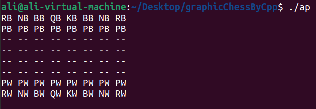
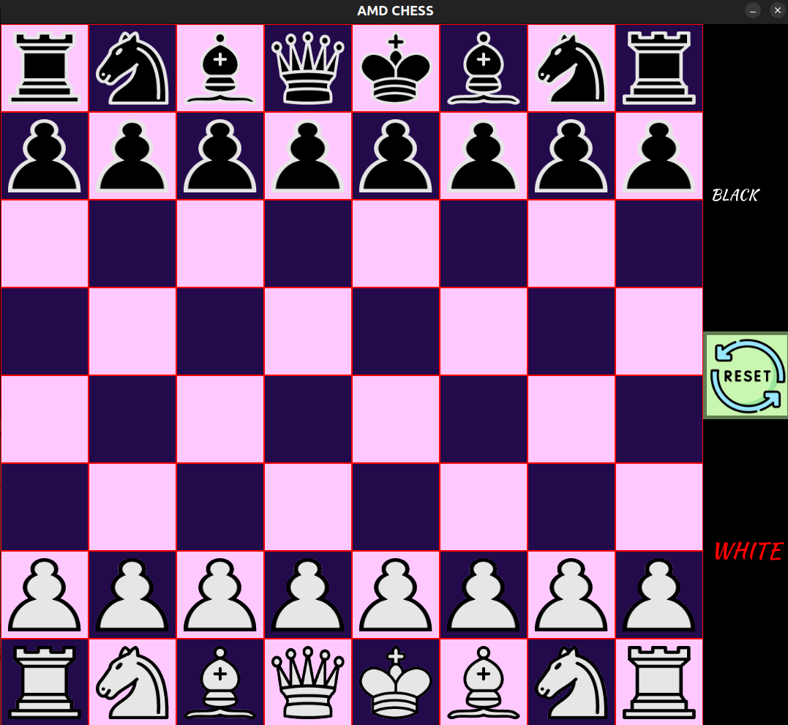

## **♟️Graphical Chess♟️** 
This is a **C++-based chess game** that utilizes **SFML (Simple and Fast Multimedia Library)** for rendering graphics. The project includes **game logic**, **piece movement**, and **a graphical user interface (GUI)**. The game allows players to move chess pieces and determine the game state based on standard chess rules.

## **Components**
### **1. Source Code (`sources/` & `headers/`)**
- The project follows **OOP principles**, with each chess piece (king, queen, rook, etc.) having its own class.
- `game_manager.cpp`: manages the game flow, player turns, and game rules.
- `board.cpp`: Handles the chessboard structure, piece placements, and movement validation.
- `main.cpp`: The entry point of the game.

### **2. CMake Integration**
- `CMakeLists.txt`: This project is built using **CMake**, which simplifies compilation.
- `CMakeFiles/`, `Makefile`: Generated build files for compiling and linking the project.

### **3. GUI & Graphics (`images/` & `font/`)**
- The `images/` folder contains chess piece sprites (`wk.png`, `bq.png`, etc.), pause/reset buttons.
- The `font/` folder contains a custom font (`KaushanScript-Regular.otf`) for rendering text in the UI.

### **4. Compilation & Execution**
- Uses **CMake** and a `Makefile` for easy building.
- The compiled binary is likely placed in `ap/`.

## **Features**
- **Graphical UI** using **SFML**
- **Turn-based chess rules**
- **Valid move checks**
- **Game state management (check, checkmate)**
🚀

Here’s a refined version with better readability, grammar, and formatting:  

---

## **How to Run the Game?**  

1. Run the compiled game file named `ap` using the following command:  
   ```sh
   ./ap
   ```  

2. Once the program starts successfully, input the board frame and arrange the pieces as shown in the following image:  

   <p align="center">
       
   </p>  

3. After setting up the board, the GUI window will open and look like this:  

   <p align="center">
       
   </p>  

### **Troubleshooting CMake Issues**  
If you encounter any issues with CMake, you can clean and rebuild the project by running the following commands:  

```sh
rm -rf CMakeCache.txt CMakeFiles/
cmake .
make
```  

Hope you enjoyed! 🚀
